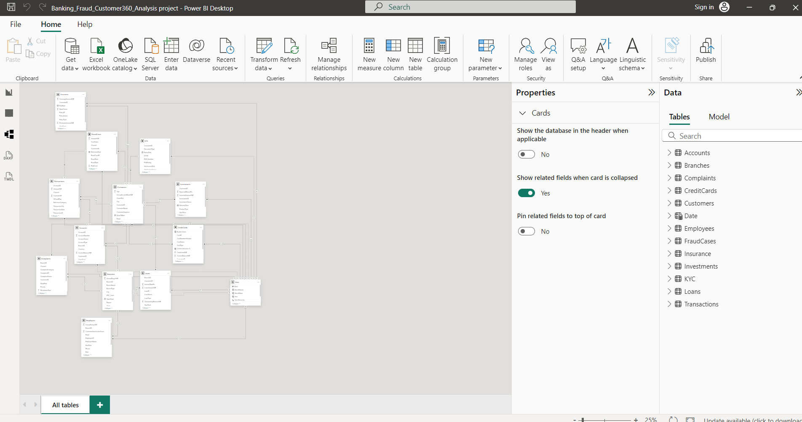
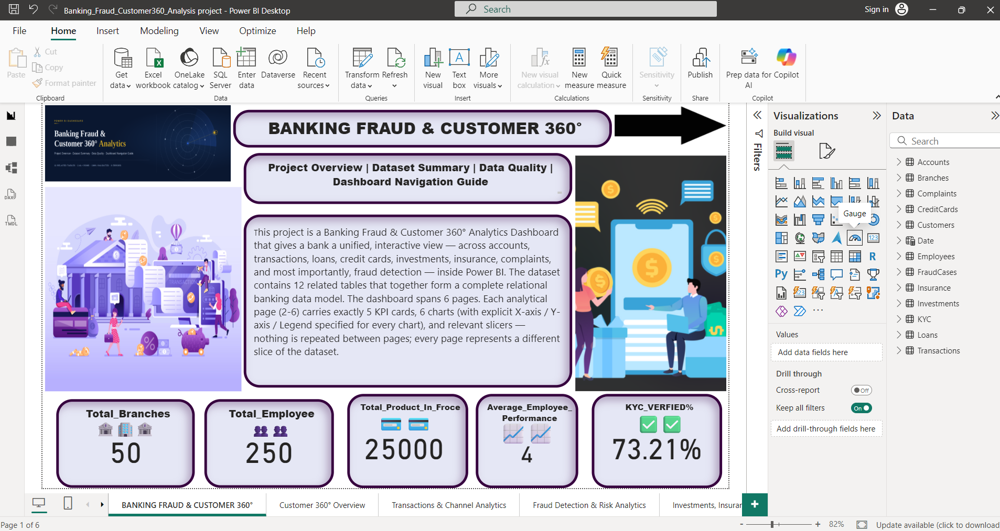
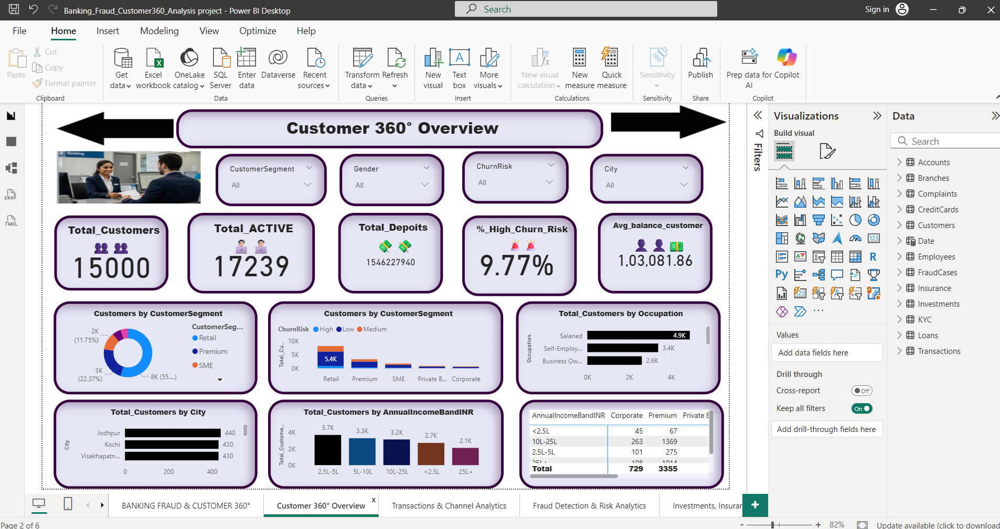
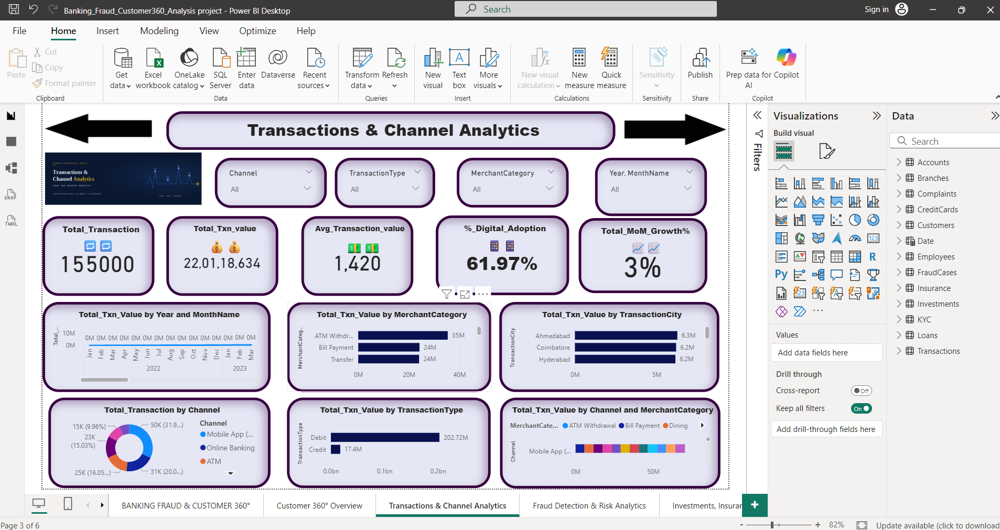
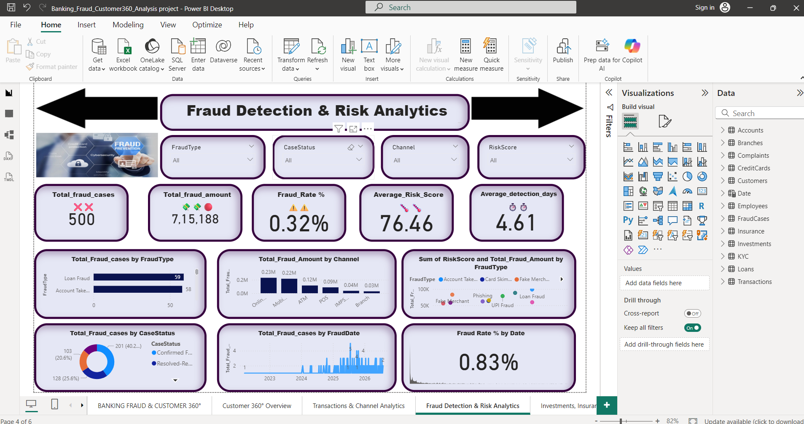
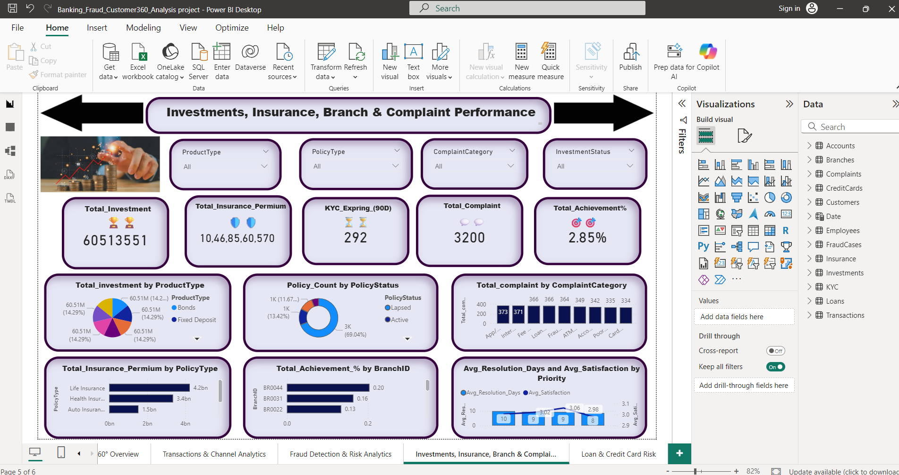
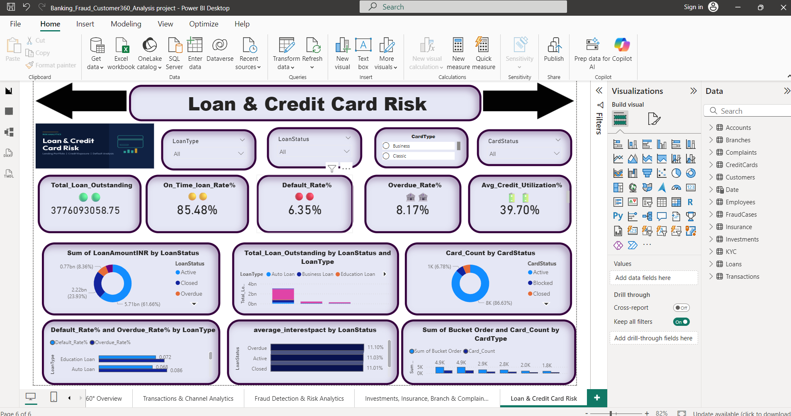

# Banking Fraud & Customer 360° — Power BI Dashboard

An end-to-end **Customer 360° and Fraud/Risk analytics dashboard** built in Power BI, covering customer segmentation, transaction behaviour, fraud detection, credit risk, and cross-sell/service performance — all on one connected 12-table data model.

> 📊 Power BI Desktop | 6 report pages | 12 connected tables | 5 KPI cards + 6 charts per page

---

## 📌 Project Overview

Banks need a single place to see customer behaviour, transaction patterns, and risk (fraud + credit) together instead of siloed reports. This project simulates that: a retail-banking dataset covering customers, accounts, transactions, loans, credit cards, fraud cases, complaints, KYC, investments, insurance, branches and employees, modelled and visualized as one connected Power BI report.

Every analytical page (2–6) follows the same design: **5 KPI cards, 6 charts, and relevant slicers** — no page repeats another's slice of the data.

**Note:** the underlying dataset is simulated/synthetic, built to mirror real banking data structures and relationships — it's a skills demonstration, not production bank data.

---

## 🖼️ Dashboard Preview

### Data Model


### Home — Banking Fraud & Customer 360°


### Customer 360° Overview


### Transactions & Channel Analytics


### Fraud Detection & Risk Analytics


### Investments, Insurance, Branch & Complaint Performance


### Loan & Credit Card Risk


---

## 🗂️ Data Model

12 tables connected in a relational model, centred on **Customers**, **Accounts** and **Transactions**:

| Table | What it holds |
|---|---|
| **Customers** | Demographics, segment, occupation, income band, churn risk, city, gender |
| **Accounts** | Account balances, product holdings, KYC status, deposits, active/inactive flags |
| **Transactions** | Individual transactions — channel, type, merchant category, city, value |
| **Loans** | Loan type, amount, status, default/overdue/on-time flags, interest |
| **CreditCards** | Card type, status, utilization, card count buckets |
| **FraudCases** | Fraud type, channel, case status, risk score, fraud amount, detection time |
| **Complaints** | Category, priority, resolution days, satisfaction score |
| **KYC** | KYC verification/expiry status, document type |
| **Investments** | Product type, investment status, amount |
| **Insurance** | Policy type, policy status, policy count |
| **Branches** | Branch performance / achievement % |
| **Employees** | Headcount, performance score |
| **Date** | Supports time intelligence (MoM growth, trends) across every page |

---

## 📑 Report Pages

### 1. Home — Banking Fraud & Customer 360°
Landing page with project overview, dataset summary, and navigation guide.

**KPIs:**
- Total Branches: **50**
- Total Employees: **250**
- Total Products in Force: **25,000**
- Avg. Employee Performance: **4**
- KYC Verified: **73.21%**

---

### 2. Customer 360° Overview
Who the bank's customers are.

**KPIs:**
- Total Customers: **15,000**
- Total Active Accounts: **17,239**
- Total Deposits: **₹1,54,62,27,940**
- % High Churn Risk: **9.77%**
- Avg. Balance/Customer: **₹1,03,081.86**

**Breakdowns:** Segment (Retail ~55%), income band, occupation (Salaried 4.9K), city (Jodhpur, Kochi, Visakhapatnam lead)

**Filters:** Segment / Gender / Churn Risk / City

---

### 3. Transactions & Channel Analytics
How customers transact.

**KPIs:**
- Total Transactions: **1,55,000**
- Total Transaction Value: **₹22,01,18,634**
- Avg. Transaction Value: **₹1,420**
- % Digital Adoption: **61.97%**
- Txn MoM Growth: **3%**

**Insights:** Mobile App and Online Banking dominate; ATM Withdrawal leads merchant category (₹35M); Debit (₹202.72M) >> Credit (₹17.4M)

---

### 4. Fraud Detection & Risk Analytics
Where fraud is concentrated and how fast it's caught.

**KPIs:**
- Total Fraud Cases: **500**
- Total Fraud Amount: **₹7,15,188**
- Fraud Rate: **0.32%**
- Avg. Risk Score: **76.46**
- Avg. Detection Time: **4.61 days**

**Insights:** Loan Fraud (59) and Account Takeover (58) lead by case count; Online Banking (₹0.23M) and Mobile (₹0.22M) carry highest fraud amount by channel

---

### 5. Investments, Insurance, Branch & Complaint Performance
Cross-sell and service quality.

**KPIs:**
- Total Investment: **₹6,05,13,551**
- Total Insurance Premium: **₹10,46,85,60,570**
- KYC Expiring (90D): **292**
- Total Complaints: **3,200**
- Branch Achievement: **2.85%**

**Insights:** Investment spread evenly across 7 product types (~14.3% each); 69% of policies Active; complaint categories fairly distributed

---

### 6. Loan & Credit Card Risk
Credit quality across loans and cards.

**KPIs:**
- Total Loan Outstanding: **₹377,60,93,058.75**
- On-Time Rate: **85.48%**
- Default Rate: **6.35%**
- Overdue Rate: **8.17%**
- Avg. Credit Utilization: **39.70%**

**Insights:** 61.66% of loan value in Active status; 86.63% of credit cards Active

---

## 💡 Key Insights

✅ **Fraud Detection Performance**
- 500 fraud cases detected totaling ₹7,15,188 at a 0.32% fraud rate
- Average risk score: 76.46, detected in 4.61 days
- Online banking and Mobile are riskiest channels (₹0.23M and ₹0.22M respectively)

✅ **Fraud Type Distribution**
- Loan Fraud (59) and Account Takeover (58) lead by case count
- Well ahead of Card Skimming, Phishing, and UPI Fraud

✅ **Digital Transformation**
- Digital adoption: 61.97% (strong shift to online/mobile)
- Debit transactions (₹202.72M) dominate over Credit (₹17.4M)
- ATM Withdrawal is the largest merchant category (₹35M)

✅ **Customer Risk Profile**
- Retail customers: ~55% of base (8K of ~14.5K)
- High churn risk: 9.77% overall
- Opportunity for targeted retention campaigns

✅ **Credit Risk Management**
- On-time performance: 85.48% (healthy)
- Default rate: 6.35%, Overdue rate: 8.17% (manageable)
- Average credit utilization: 39.70% (conservative)

---

## 🛠️ Skills Demonstrated

| Area | Evidence |
|---|---|
| **Data Modelling** | 12-table relational model spanning customer, product, transaction and risk domains |
| **DAX** | Rate, average, month-over-month growth, and count-based measures across every page |
| **Dashboard/UX Design** | Consistent 5-card + slicer + 6-chart layout repeated across 5 analytical pages |
| **Data Storytelling** | Logical flow: overview → customer → transactions → fraud → products → credit risk |
| **Domain Knowledge** | Banking KPIs: churn risk, digital adoption, KYC compliance, credit utilization |
| **Visualization Range** | Cards, donut/pie, bar/column/clustered, combo, line, scatter, KPI, pivot table |

---

## 🚀 Quick Start

### Prerequisites
- **Power BI Desktop** (free download from [Microsoft](https://powerbi.microsoft.com/en-us/desktop/))

### Steps
1. **Clone this repo**
   ```bash
   git clone https://github.com/khanhusein/banking-fraud-dashboard.git
   cd banking-fraud-dashboard
   ```

2. **Open the dashboard**
   - Double-click `Banking_Fraud_Customer360_Analysis project.pbix`
   - Or open Power BI Desktop → File → Open

3. **Explore the slicers**
   - Filter by Segment, Channel, City, Time Period, Fraud Type, and more on each page

---

## 📂 Project Structure

```
banking-fraud-dashboard/
├── README.md
├── Banking_Fraud_Customer360_Analysis project.pbix
└── screenshots/
    ├── 00_data_model.png
    ├── 01_home.png
    ├── 02_customer360.png
    ├── 03_transactions.png
    ├── 04_fraud.png
    ├── 05_investments.png
    └── 06_loans.png
```

---

## 🔮 Future Enhancements

- [ ] Row-level security (branch managers see only their branch)
- [ ] Drillthrough pages from summary cards to case-level detail
- [ ] Real-time fraud alerting with configurable thresholds
- [ ] Live/scheduled-refresh data source (replace static import)
- [ ] Mobile-optimized dashboard views
- [ ] Predictive churn scoring model integration

---

## 📝 License

This project is provided as-is for educational and portfolio purposes.

---

## 👤 Author

**Mohammed Husein Khan**

🔗 **Links:**
- [LinkedIn](https://www.linkedin.com/in/mohammed-husein-khan-615645427)
- [GitHub](https://github.com/khanhusein)

---

## 💬 Questions?

Feel free to open an **Issue** on GitHub or connect via LinkedIn for questions or collaboration opportunities.

---

**Last Updated:** August 13, 2026  
**Power BI Version:** Latest Desktop  
**Data:** Simulated retail banking dataset
